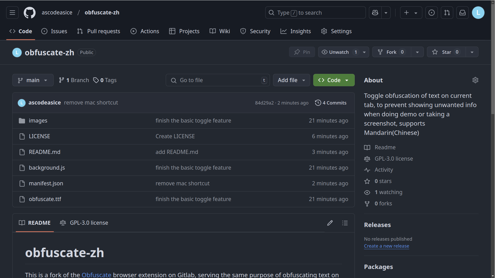
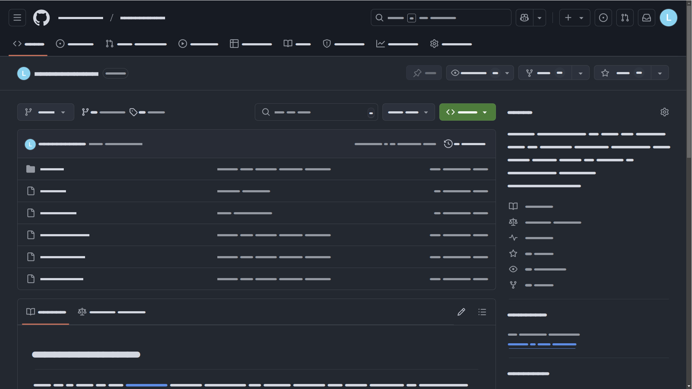

# obfuscate-zh

This is a fork of the [Obfuscate](https://gitlab.com/nin_/obfuscate/-/tree/main) browser extension on Gitlab, serving the same purpose of obfuscating text on current tab.

This fork has extra features as listed:

- support toggling obfuscation by pressing the extension icon multiple times
- support obfuscating Chinese characters by using modified version of Flow-Circular font

## Preview

Original tab:

Obfuscated tab:

## How to use

1. git clone or download the entire repo
2. Go to [chrome extension page](chrome://extensions/), enable developer mode
3. Click **Load unpacked** button, and select the directory of this repo
4. Toggle obfuscation on tab by pressing this extension or using shortcut keys

## License

If you find that any part of the licensing for the code or fonts inadvertently infringes upon your rights, please contact me immediately, and I will address and correct the issue as soon as possible.

### Code License

This project is licensed under the GNU General Public License v3 (GPLv3).
You are free to use, modify, and redistribute this project under the terms of the GPLv3.
Please see the [LICENSE](LICENSE) file for the full license text.

### Font License

The Flow Circular font used in this project is a modified version of the original release by the Flow Project Authors (2020), which was licensed under the SIL Open Font License Version 1.1.

The modified part is changing the font style of every chinese character to look like the "A" character in the original font.

## Credits

- [Obfuscate](https://gitlab.com/nin_/obfuscate/-/tree/main?ref_type=heads) extension for the original idea and code
- [Flow Circular fonts](https://fonts.google.com/specimen/Flow+Circular) on google fonts
